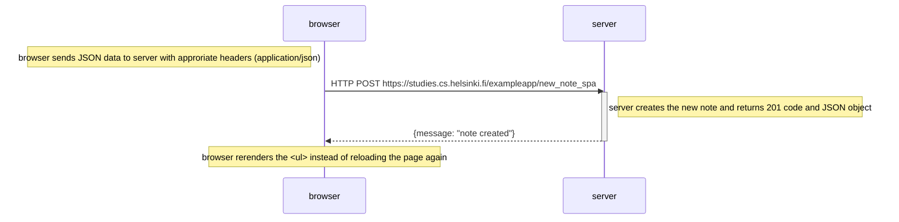

```mermaid
sequenceDiagram
    participant browser
    participant server
    Note left of browser: browser sends JSON data to server with approriate headers (application/json)
    browser ->> server: HTTP POST https://studies.cs.helsinki.fi/exampleapp/new_note_spa
    activate server
    Note right of server: server creates the new note and returns 201 code and JSON object
    server -->> browser: {message: "note created"}
    deactivate server
    Note over browser: browser rerenders the <ul> instead of reloading the page again
```
